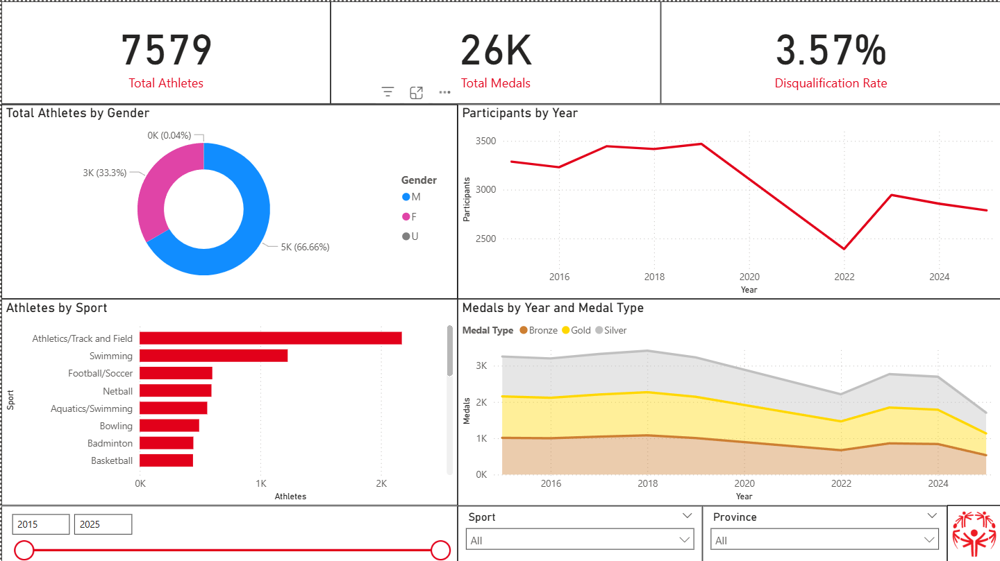

# Project: Special Olympics Data Dashboard

> [!NOTE]
> Grading? Skip to [Final Deliverables](#final-deliverables) to find the files you are looking for in this project.

The final Power BI dashboard is available online at [PowerBI Web (TM Only - doesn't look great)](https://app.powerbi.com/links/GCpQLOmmdj?ctid=77d33cc5-c9b4-4766-95c7-ed5b515e1cce&pbi_source=linkShare), or locally in [./pbix/r0984834_Dashboard.pbix - better quality](./pbix/r0984834_Dashboard.pbix). You can also view page screenshots in [./pbix/pages](./pbix/pages).

## Overview

This project is about building an end-to-end data solution for the Special Olympics. We are acting as consultants for a client (Special Olympics) to transform raw data into actionable insights using Python and Power BI.

## Example



## The Goal

The main objective is to answer business questions about athlete participation, performance trends, and regional statistics. We need to show things like:

- Athlete distribution by age, gender, and sport.
- Performance improvements over time.
- Regional participation stats.

## Tech Stack

- **Source Data:** Raw Excel files (Certifications, Clubs, Historical Results).
- **ETL & Transformation:** Python (OOP principles).
- **Versioning:** GitHub.
- **Visualization:** Microsoft Power BI.
- **(Bonus):** MySQL & Medallion Architecture.

## Run the ETL

Use the uv-managed environment under `src\.venv`:

```powershell
uv venv src\.venv
uv pip install --python src\.venv\Scripts\python.exe -r src\requirements.txt
src\.venv\Scripts\python.exe src\main.py
```

This runs the full medallion pipeline from raw Excel files to validated gold-layer CSVs:

```text
data/raw -> data/bronze -> data/silver -> data/gold
```

## Project Workflow

- **Project Management:** Weekly planning and task breakdown.
- **Modeling:** Designing a Star Schema (Facts & Dimensions).
- **ETL Pipeline:** Writing Python scripts to clean raw Excel files and save them as CSVs.
- **Dashboarding:** Importing clean data into Power BI to build a professional report.
- **Validation:** Documenting everything and proving the numbers match the source.

## Final Data Model

The final Power BI model is a star schema with 5 dimensions and 2 facts:

| Table                    |   Rows | Purpose                                               |
| ------------------------ | -----: | ----------------------------------------------------- |
| `dim_athlete.csv`        | 20,221 | Certified people, demographics, and certificate flags |
| `dim_geography.csv`      |    437 | Clubs/delegations and regional attributes             |
| `dim_sport.csv`          |     23 | Distinct sports                                       |
| `dim_event.csv`          |    210 | Normalized competition events                         |
| `dim_time.csv`           |     11 | Reporting years, including the 2020-2021 COVID gap    |
| `fact_results.csv`       | 72,702 | Event-level performance results                       |
| `fact_participation.csv` | 27,829 | Athlete participation by club and year                |

The latest reproducibility run completed with **68/68 validation checks passed**. See [final validation](./docs/md/r0984834_FinalValidation.md) and the detailed [dimensional model](./docs/md/r0984834_DimensionalModel.md).

## Final Deliverables

Use this section as the grading checklist. It maps the evaluation criteria directly to the files that prove each requirement.

| Category                     | Criterion                  |  Points | Where to evaluate                                                                                                                                                                                                                     |
| ---------------------------- | -------------------------- | ------: | ------------------------------------------------------------------------------------------------------------------------------------------------------------------------------------------------------------------------------------- |
| Management & Modeling        | Phase 0: Project Plan      |       5 | [Project plan](./pm/r0984834_ProjectPlan.md) or [PDF version](./pm/r0984834_ProjectPlan.pdf)                                                                                                                                          |
| Management & Modeling        | Phase 1: Dimensional Model |      15 | [Dimensional model documentation](./docs/md/r0984834_DimensionalModel.md), [model image](./docs/img/r0984834_Model.png), and [data requirements](./docs/md/r0984834_DataRequirements.md)                                              |
| Python Pipeline & Versioning | ETL Logic & OOP            |      15 | Python package in [src](./src), entry point [src/main.py](./src/main.py), orchestration in [src/orchestration](./src/orchestration), ETL layers in [src/bronze](./src/bronze), [src/silver](./src/silver), and [src/gold](./src/gold) |
| Python Pipeline & Versioning | Versioning (GitHub)        |      10 | [Commit history](https://github.com/aryxenv/data_case_special_olympics/commits/main) and [pull requests](https://github.com/aryxenv/data_case_special_olympics/pulls?q=is%3Apr) with conventional commits                             |
| Python Pipeline & Versioning | Code Structure             |      10 | Clean source layout in [src](./src), shared paths in [src/core](./src/core), profiling in [src/profiling](./src/profiling), validation in [src/quality](./src/quality), and run instructions in [Run the ETL](#run-the-etl)           |
| Power BI Development         | Wireframe                  |       5 | [Dashboard wireframe](./docs/img/r0984834_Wireframe.png)                                                                                                                                                                              |
| Power BI Development         | Semantic Model & Measures  |      10 | [Power BI file](./pbix/r0984834_Dashboard.pbix), [Power BI setup and measures](./pbix/README.md), and [dimensional model](./docs/md/r0984834_DimensionalModel.md)                                                                     |
| Power BI Development         | Actionable Dashboard       |      10 | [Power BI file](./pbix/r0984834_Dashboard.pbix) and page screenshots: [overview](./pbix/pages/overview.png), [athlete](./pbix/pages/athlete.png), [performance](./pbix/pages/performance.png), [region](./pbix/pages/region.png)      |
| Documentation & Validation   | Data Dictionary            |      10 | [Data requirements](./docs/md/r0984834_DataRequirements.md), [data exploration and audit](./docs/md/r0984834_DataExploration.md), and [dimensional model](./docs/md/r0984834_DimensionalModel.md)                                     |
| Documentation & Validation   | Validation Audit           |      10 | [Final validation and self-evaluation](./docs/md/r0984834_FinalValidation.md), automated validator in [src/quality](./src/quality), and validated CSV outputs in [data/gold](./data/gold)                                             |
| **Total**                    |                            | **100** |                                                                                                                                                                                                                                       |

> [!IMPORTANT]
> I'm not giving myself max points, just making your life easier to know the point split for each item!

Additional supporting files:

- [AI usage disclosure](./AI.md)
- [Power BI documentation](./pbix/README.md)
- [Generated gold-layer CSVs](./data/gold)

<!-- llm-mem:readme:start -->

## llm-mem

This repository is configured for [llm-mem](https://github.com/aryxenv/llm-mem) Copilot MCP integration. llm-mem keeps its index and run artifacts in the local `.llm-mem/` directory, which is intentionally ignored by Git.

If you do not already have the `llm-mem` CLI installed, clone or open the llm-mem source repo and link the CLI first:

```powershell
git clone https://github.com/aryxenv/llm-mem.git
cd llm-mem
npm install
npm run build
npm run link:cli
```

Then, from this repository, bootstrap your local index and MCP wiring:

```powershell
llm-mem integrate copilot install
```

Keep using `copilot` normally after that. The project MCP config, skill, and instructions tell Copilot when to use llm-mem context tools.

<!-- llm-mem:readme:end -->
