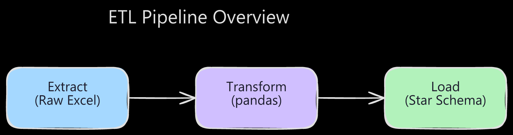

# Visuals Skill — End-to-End Test

This file demonstrates the full Excalidraw visuals workflow.

## ETL Pipeline

[📝 Edit on Excalidraw](https://excalidraw.com/#json=Pbbviu-3Er0l3JoNXp0ZV,qADfHBTF2S5EUDOfwBYHEg)

---

### Workflow steps followed

1. ✅ Designed diagram with `excalidraw-create_view` (Excalidraw MCP)
2. ✅ Saved source to `excalidraw/diagrams/excalidraw/etl-pipeline.excalidraw`
3. ✅ Exported dark-mode PNG via `node excalidraw/scripts/export-excalidraw.js` → `excalidraw/diagrams/export/etl-pipeline.png`
4. ✅ Uploaded to Excalidraw.com for shareable edit link
5. ✅ Embedded in this markdown: inline image + edit link
